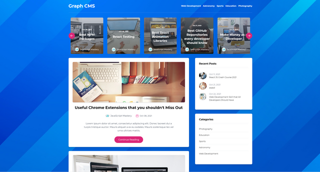

# CMS-Blog

## A fully responsive website for managing blogs 

Things used in this project:
  1. NextJs Framework
  2. HYgraph (Really a great CMS for making all your site content dynamic with an amazing dashboard control)
  3. graphQl
  4. NextJs Backend (For creating endpoint for handling comments)
  5. css framework: Tailwind

This Application ([CMS Blog](https://cms-blog-m7fc.vercel.app/)) has the following features:

- Home page contains featured and recent posts, categories. full markdown articles, author information
- Post details page contains related posts, categories, author information and comments

